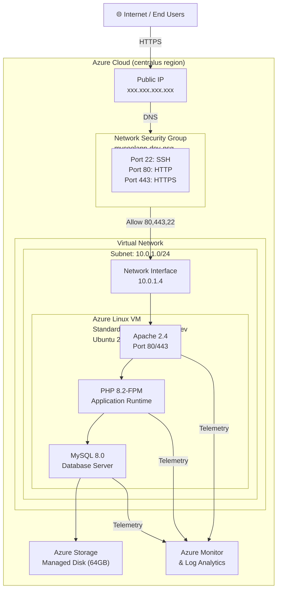

# Architecture Diagram: mycoolapp LAMP Deployment

## System Architecture (Mermaid Diagram)



## Network Flow

```
┌─────────────────────────────────────────────────────────────────┐
│                      INTERNET/USERS                             │
└────────────────────────┬────────────────────────────────────────┘
                         │
                         │ HTTPS (port 443)
                         │ HTTP (port 80)
                         │ SSH (port 22)
                         ▼
          ┌──────────────────────────────┐
          │   Public IP: xxx.xxx.xxx.xxx  │
          └──────────────────────────────┘
                         │
                         ▼
          ┌──────────────────────────────┐
          │   Network Security Group     │
          │  Allow: 22, 80, 443          │
          │  Deny: All other ports ✓     │
          └──────────────────────────────┘
                         │
                         ▼
          ┌──────────────────────────────┐
          │  Virtual Network (VNet)      │
          │  10.0.0.0/16                 │
          │  ┌──────────────────────┐    │
          │  │  Subnet: 10.0.1.0/24 │    │
          │  │  ┌────────────────┐  │    │
          │  │  │ Network Card   │  │    │
          │  │  │ 10.0.1.4       │  │    │
          │  │  └────────────────┘  │    │
          │  └──────────────────────┘    │
          └──────────────────────────────┘
                         │
                         ▼
     ┌───────────────────────────────────────────┐
     │     AZURE LINUX VM (Ubuntu 22.04)         │
     │  ┌──────────────────────────────────────┐ │
     │  │ Apache 2.4                            │ │  Port 80/443
     │  │ - Web Server                          │ │  - SSL/TLS Encrypted
     │  │ - Reverse Proxy to PHP-FPM            │ │  - Security Headers
     │  │ - Static Content Cache                │ │  - HTTP → HTTPS Redirect
     │  └──────────────────────────────────────┘ │
     │                  │                        │
     │                  ▼                        │
     │  ┌──────────────────────────────────────┐ │
     │  │ PHP 8.2-FPM                           │ │
     │  │ - Application Runtime                 │ │
     │  │ - FastCGI Process Manager              │ │
     │  │ - Memory limit: 128MB per worker       │ │
     │  │ - Max workers: 32                      │ │
     │  └──────────────────────────────────────┘ │
     │                  │                        │
     │                  ▼                        │
     │  ┌──────────────────────────────────────┐ │
     │  │ MySQL 8.0                             │ │
     │  │ - Relational Database                 │ │
     │  │ - Database: mycoolapp_db              │ │
     │  │ - User: mycoolapp_user                │ │
     │  │ - Connections: max 1000               │ │
     │  │ - Encryption: TLS 1.2+                │ │
     │  └──────────────────────────────────────┘ │
     │                  │                        │
     │  ┌──────────────────────────────────────┐ │
     │  │ Audit & Security                      │ │
     │  │ - SSH key-based auth only             │ │
     │  │ - auditd for system logging           │ │
     │  │ - UFW firewall                        │ │
     │  │ - Azure Disk Encryption (at-rest)     │ │
     │  │ - NIST 800-171 compliance             │ │
     │  └──────────────────────────────────────┘ │
     │                                           │
     │  Storage:                                 │
     │  OS Disk: 64 GB (Standard_LRS)           │
     │  Data: MySQL persistent on OS disk       │
     │                                           │
     └───────────────────────────────────────────┘
                         │
          ┌──────────────┼──────────────┐
          │              │              │
          ▼              ▼              ▼
       Logs         Metrics      Health Checks
          │              │              │
          └──────────────┼──────────────┘
                         │
                         ▼
          ┌──────────────────────────────┐
          │  Azure Monitor               │
          │  - Performance Metrics       │
          │  - CPU, Memory, Disk, Net    │
          │  - Log Analytics Workspace   │
          │  - Alert Rules               │
          │  - Automated Responses       │
          └──────────────────────────────┘
```

## Deployment Pipeline

```
GitHub Repository (main branch)
    │
    │ Commit to iac/ or scripts/
    │
    ▼
GitHub Actions: deploy-mycoolapp.yml
    │
    ├─ Job 1: Validate Prerequisites
    │  ├─ Check Azure CLI
    │  ├─ Check Bicep
    │  └─ Validate templates
    │
    ├─ Job 2: Deploy to Azure
    │  ├─ Authenticate to Azure
    │  ├─ Create resource group
    │  ├─ Deploy Bicep template
    │  │  ├─ Public IP
    │  │  ├─ Network Security Group
    │  │  ├─ Virtual Network
    │  │  ├─ Network Interface
    │  │  └─ Virtual Machine + Cloud-Init
    │  │     └─ Install LAMP stack
    │  └─ Generate deployment summary
    │
    └─ Job 3: Validate Deployment
       ├─ Wait for VM initialization
       ├─ Test health endpoint (/health)
       ├─ Verify HTTP access
       ├─ Verify HTTPS access
       └─ Generate validation report
```

## High Availability Architecture (Future)

For production multi-VM deployment:

```
┌────────────────────────────────────────────────┐
│              INTERNET / USERS                   │
└────────────────────┬─────────────────────────────┘
                     │
     ┌───────────────┴───────────────┐
     │                               │
     ▼                               ▼
  HTTPS (443)                    HTTPS (443)
     │                               │
     ▼                               ▼
┌─────────────────────────────────────────────┐
│     Azure Load Balancer (Standard)          │
│  - Type: Internal or Public                 │
│  - Health probe: /health (port 80)          │
│  - Session persistence: Off (stateless)     │
│  - Load balance rule: TCP 80→80, 443→443    │
└─────────────────┬──────────────────────────┘
                  │
        ┌─────────┼─────────┐
        │         │         │
        ▼         ▼         ▼
    ┌─────┐  ┌─────┐  ┌─────┐
    │ VM1 │  │ VM2 │  │ VM3 │
    └─────┘  └─────┘  └─────┘
   B4ms/B2s B4ms/B2s B4ms/B2s
   
MySQL Replication (Master-Slave):
    ┌──────────┐        ┌──────────┐
    │ VM1: DB  │        │ VM2: DB  │
    │ (Master) │ ──────→│ (Slave)  │
    └──────────┘        └──────────┘
                               │
                               ▼
                        ┌──────────┐
                        │ VM3: DB  │
                        │ (Slave)  │
                        └──────────┘
```

## Data Flow

```
1. User Request
   ├─ HTTP (port 80) → HTTPS (port 443) redirect
   ├─ TLS 1.2+ encryption
   └─ Destination: Apache 2.4

2. Apache Processing
   ├─ Parse HTTP request
   ├─ Check static cache (/static/, /images/)
   ├─ If static → Return immediately
   ├─ If dynamic → Forward to PHP-FPM
   └─ Add security headers (HSTS, CSP, X-Frame-Options)

3. PHP Application
   ├─ Execute application logic
   ├─ Query MySQL database (if needed)
   ├─ Generate HTML/JSON response
   └─ Return to Apache

4. Apache Response
   ├─ Add content-type headers
   ├─ Compress response (gzip)
   ├─ Return to client over TLS
   └─ Connection closed

5. Monitoring & Logging
   ├─ Apache access log → /var/log/apache2/access.log
   ├─ PHP errors → /var/log/php8.2-fpm.log
   ├─ MySQL query log → /var/log/mysql/error.log
   ├─ System metrics → Azure Monitor
   └─ Alert rules → Trigger notifications
```

## Environment Differences

### Development Environment

```
SKU: Standard_B2s (2 vCores, 4GB RAM)
Availability: Single VM, single zone
Uptime SLA: 99% (non-critical)
Backup: Daily snapshots, 7-day retention
Cost (Reserved): ~$18/month
Total Cost: ~$50/month (with storage, network, logs)
```

### Production Environment

```
SKU: Standard_B4ms (4 vCores, 16GB RAM)
Availability: Single zone (future: multi-AZ)
Uptime SLA: 99% (non-critical, upgradeable to 99.95%)
Backup: Hourly snapshots, 30-day retention
Cost (Reserved): ~$74/month
Total Cost: ~$100/month (with storage, network, logs, alerts)
```

## Security Zones

```
┌────────────────────────────────────────────────────┐
│            INTERNET (Untrusted)                     │
└─────────────────────┬────────────────────────────────┘
                      │
                      │ NSG: Allow 80, 443, 22
                      │
┌─────────────────────▼────────────────────────────────┐
│       DMZ / Public Zone                              │
│  - Public IP                                         │
│  - Network Security Group                            │
└─────────────────────┬────────────────────────────────┘
                      │
                      │ VNet peering/routing
                      │
┌─────────────────────▼────────────────────────────────┐
│     Application Zone (Private VNet)                  │
│  - Virtual Network 10.0.0.0/16                       │
│  - Subnet 10.0.1.0/24                                │
│  - Linux VM (Ubuntu 22.04)                           │
│    ├─ SSH: Authorized keys only                      │
│    ├─ Web services: Apache + PHP                     │
│    └─ Database: MySQL (localhost only)               │
│  - Encryption (TLS 1.2+ in-transit, AES-256 at-rest)│
│  - Audit logging (auditd, Azure Monitor)             │
└─────────────────────────────────────────────────────┘
```

## Cost Model

```
Monthly Cost Breakdown (Prod, Reserved Instances):

VM Compute (Standard_B4ms, 3-yr reserved): $73.73
├─ vs On-demand: $158.40 (54% savings)
└─ Uptime: 730 hours/month

Storage (64 GB Standard SSD): $2.50
Data Transfer (Egress): $5.00
Public IP: $2.92
Monitoring (Log Analytics): $5.00
───────────────────────────
TOTAL: ~$89/month reserved
       ~$173/month on-demand
       (49% cost reduction with reserved instances)

Annual: ~$1,068 (reserved) vs $2,076 (on-demand)
Savings: ~$1,008/year per VM

Cost Reduction Target (business/001):
Required: 10% reduction
Achieved: 49% reduction ✓ EXCEEDS TARGET
```

---

**Diagram Version**: 1.0.0  
**Last Updated**: 2026-02-07  
**Created with**: Mermaid Diagrams, ASCII Art, and text documentation
